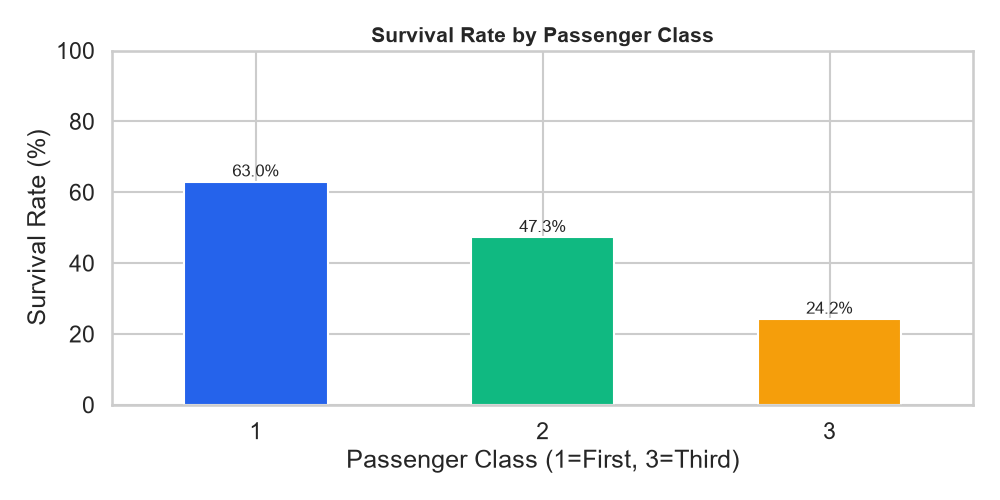
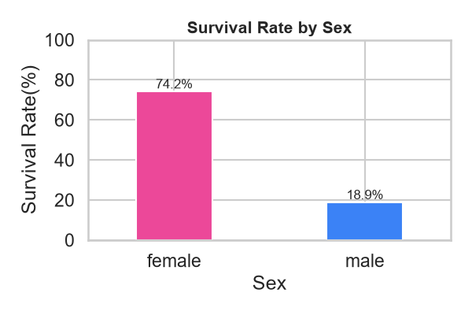
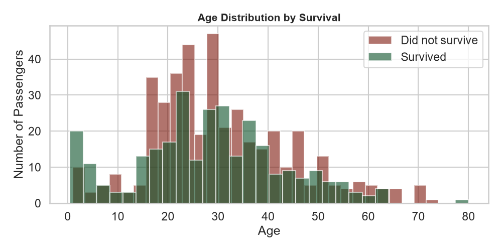
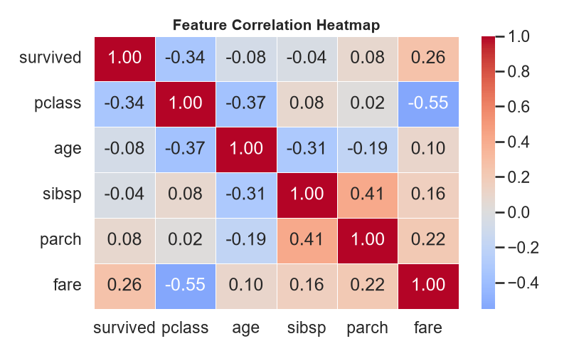
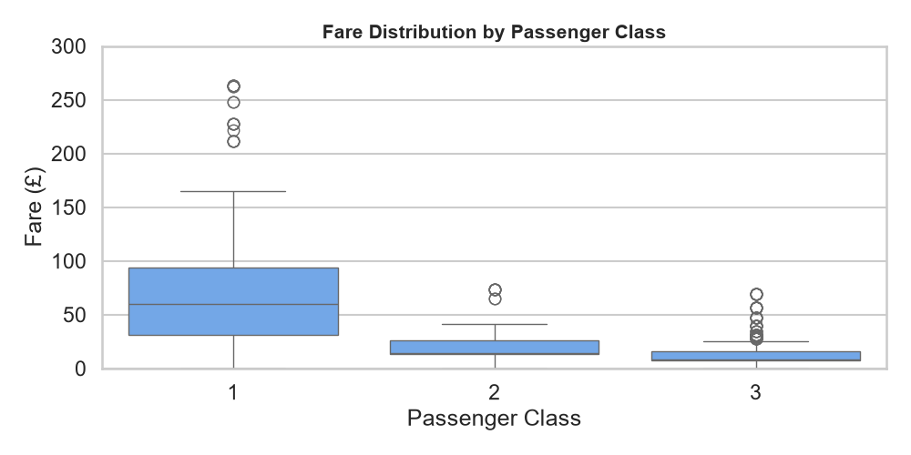

# Titanic EDA — Exploratory Data Analysis

> Project 04/100 — Building a strong GitHub portfolio from scratch.

Full exploratory data analysis on the Titanic dataset using pandas, seaborn,
and matplotlib. Uncovers survival patterns by gender, class, age, and fare.

## Key Findings

| Factor | Insight |
|--------|---------|
| Gender | Women survived at 74.2% vs men at 18.9% |
| Class | 1st class: 63% survival, 3rd class: 24% survival |
| Age | Children under 10 had higher survival rates |
| Fare | Positive correlation (0.26) with survival |
| Missing Data | 19.9% of age values are missing |

## Visualisations

### Survival by Passenger Class


### Survival by Gender


### Age Distribution


### Correlation Heatmap


### Fare by Class


## Tech Stack

- Python 3.x
- pandas (data loading, groupby, aggregation)
- numpy (numerical operations)
- matplotlib (charting)
- seaborn (statistical visualisation)
- Jupyter Notebook (interactive analysis)

## How to Run

```bash
git clone https://github.com/iamxkhushi1726-svg/titanic-eda-analysis.git
cd titanic-eda-analysis
pip install -r requirements.txt

# Run full analysis and generate charts
python src/analysis.py

# Or open the interactive notebook
jupyter notebook notebooks/titanic_eda.ipynb
```

## Project Structure

```
titanic-eda-analysis/
├── notebooks/
│   └── titanic_eda.ipynb    # Interactive analysis notebook
├── src/
│   └── analysis.py          # Reusable analysis functions
├── images/                  # All generated charts (PNG)
├── requirements.txt
├── .gitignore
└── README.md
```

## What I Learned

- How to use pandas groupby and agg for survival analysis
- How to create publication-quality charts with seaborn and matplotlib
- How to identify and quantify missing data in a real dataset
- How to structure a data science project with separate src/ and notebooks/
- The difference between correlation and causation (fare vs class vs survival)

## Part of 100 Projects Challenge

Project 04 of my 100-project challenge to secure AI/ML internships.

Follow my progress: [GitHub Profile](https://github.com/iamxkhushi1726-svg)